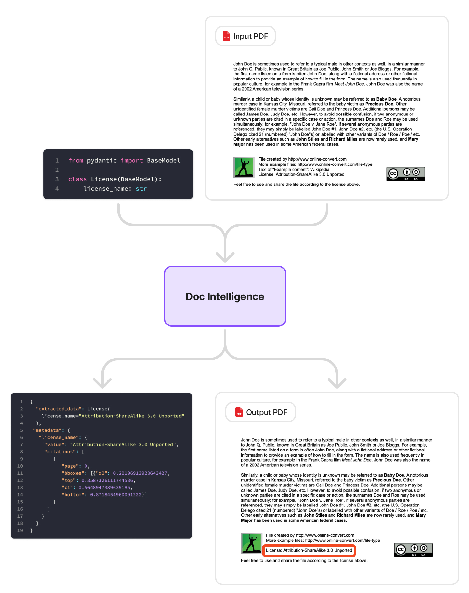

# Document AI

**Documentation:** [https://zeel-04.github.io/doc-intelligence/](https://zeel-04.github.io/doc-intelligence/)

A library for parsing, formatting, and processing documents that can be used to build AI-powered document processing pipelines with structured data extraction and citation support.



## Features

- Extract structured data from PDF documents using LLMs
- Automatic citation tracking with page numbers, line numbers, and bounding boxes
- Support for digital PDFs and scanned (image-only) PDFs via OCR
- Type-safe data models using Pydantic
- Multi-provider LLM support: OpenAI, Anthropic, Gemini, Ollama
- Pluggable OCR pipeline — swap in any layout detector or OCR engine

## Installation

### Requirements

- Python >= 3.10
- An API key for your chosen LLM provider (OpenAI, Anthropic, or Gemini) — or a local Ollama server

### Install with uv

```bash
# Digital PDFs only
uv pip install doc-intelligence

# Scanned PDFs (adds PaddleOCR)
uv pip install "doc-intelligence[ocr]"
```

Or with pip:

```bash
pip install doc-intelligence
pip install "doc-intelligence[ocr]"  # for scanned PDF support
```

## Quick Start

Set up your API key (example with OpenAI):

```bash
echo "OPENAI_API_KEY=your-api-key-here" > .env
```

Here's a simple example to extract structured data from a PDF:

```python
from dotenv import load_dotenv
from pydantic import BaseModel

from doc_intelligence import PDFProcessor

# Load environment variables
load_dotenv()

# Define your data model
class License(BaseModel):
    license_name: str

# Create a processor and extract in two lines
processor = PDFProcessor(provider="openai")
result = processor.extract(
    uri="https://example-files.online-convert.com/document/pdf/example.pdf",
    response_format=License,
    include_citations=True,
    extraction_mode="single_pass",
    model="gpt-4o-mini",
)

# Access the extracted data and citations
print(f"Extracted data: {result.data}")
print(f"Metadata: {result.metadata}")
```

### Sample Output

The `extract` method returns an `ExtractionResult` with `.data` and `.metadata` attributes:

```python
result.data
# License(license_name='Attribution-ShareAlike 3.0 Unported')

result.metadata
# {
#     'license_name': {
#         'value': 'Attribution-ShareAlike 3.0 Unported',
#         'citations': [{
#             'page': 0,
#             'bboxes': [{
#                 'x0': 0.201,
#                 'top': 0.859,
#                 'x1': 0.565,
#                 'bottom': 0.872
#             }]
#         }]
#     }
# }
```

## Scanned PDFs

For image-only PDFs, add `document_type="scanned"`:

```python
processor = PDFProcessor(provider="openai", document_type="scanned")
result = processor.extract("scanned_invoice.pdf", Invoice)
```

Or use the one-liner:

```python
from doc_intelligence import extract

result = extract("scanned.pdf", Invoice, provider="openai", document_type="scanned")
```

See the [Scanned PDFs guide](https://zeel-04.github.io/doc-intelligence/scanned-pdfs/) and
[Custom OCR Components](https://zeel-04.github.io/doc-intelligence/custom-ocr/) docs for details.

## Documentation

For more detailed documentation, see the [docs](./docs) directory or visit the [documentation site](https://zeel-04.github.io/doc-intelligence/).

## Development Setup

Prerequisites:

- Python 3.10+
- uv

```bash
git clone https://github.com/zeel-04/doc-intelligence.git
cd doc_intelligence
uv venv
uv sync
```
